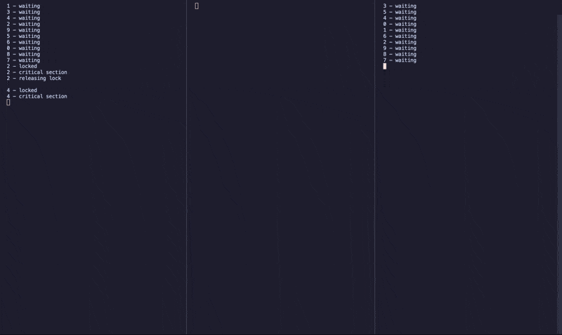

# Distributed Lock using Temporal

> [!CAUTION]
> This should not be used by anyone, ever.

## What is it?

A distributed lock built using Temporal by abusing activity tasks.



## How to run the example

In separate terminals, run;

```sh
go run ./example
```

## Caveats

So, so many.

## But, why?

Why not 🤷‍♂️